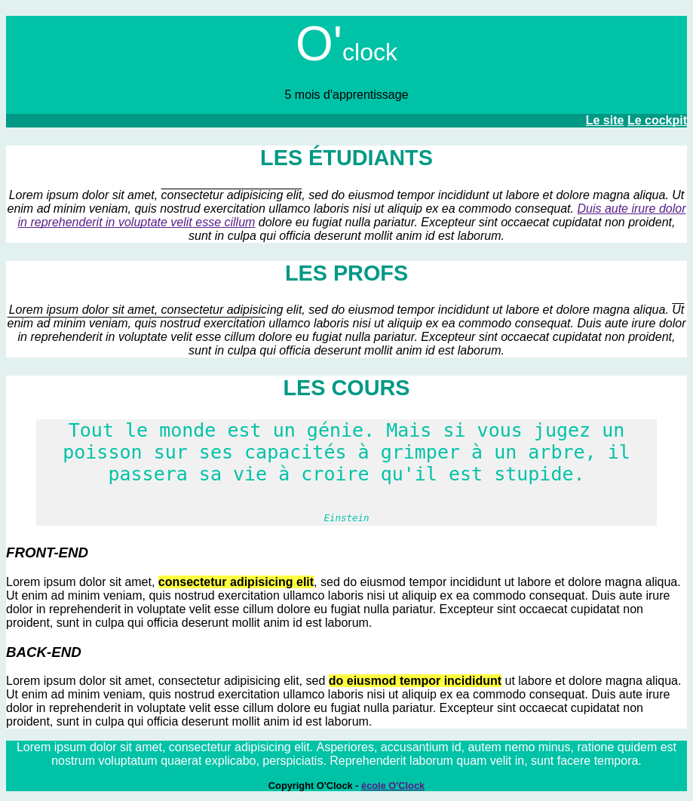
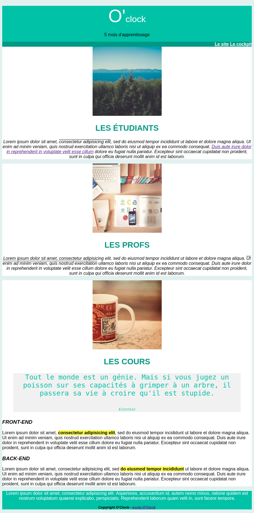

# Challenge Discover CSS

# Énoncé du Challenge

Aujourd'hui,
1. on tune un peu notre Atom,
2. on explore quelques possibilités de CSS.

## Instructions

### 1. Atom tuning

- Allez lire comment [on peut tuner son Atom](https://github.com/O-clock-.../fiches-recap/blob/master/atom/packages.md)
* Installez ces packages:
  - [File Icons](https://atom.io/packages/file-icons)
  - [Pigments](https://atom.io/packages/pigments)
  et commencez à profiter de la puissance des watts! (Pardon, de l'ergonomie de ce super éditeur de code.)

### 2. Exercice de style
Vous avez vu comment écrire des directives CSS simples. Voyons ce qu'on peut déjà modifier avec CSS.

1. Téléchargez ce dossier complet (bouton vert "Clone or download", puis "Download ZIP"), et installez le dans votre repertoire `html`, ou un sous-répertoire.  
2. Liez la feuille de style `css/style.css` au fichier HTML `html/index.html`.
3. Ajoutez des règles de styles dans `css/style.css` pour que le rendu de la page corresponde à l'image.

## BONUS

- Les liens changent de couleur lorsqu'on les survole, cette page du [MDN](https://developer.mozilla.org/fr/docs/Web/CSS/:hover) pourrait s'avérer utile :)
- Quelques images pour illustrer notre page

Où trouver des images rapidement ? Certains sites comme [picsum photos](https://picsum.photos/), [unsplash](https://source.unsplash.com/) ou [lorempixel](http://lorempixel.com/) peuvent vous permettre d'utiliser des photos simplement.

Par exemple pour afficher cette photo

il suffit d'utiliser cette URL : `https://picsum.photos/200`

Voici le résultat avec quelques photos

